Basics
======

    library(dplyr)
    library(ggplot2)
    library(ggthemes)

The ggplot2 package (Wickham and Chang 2016) is based on “The Grammar of
Graphics” (Wilkinson 2005). This theoretical framework helps us to
construct statistical graphics by specifying several components. See
<https://bookdown.org/fjmcgrade/ismaykim/3-viz.html>

    data(iris)
    glimpse(iris)

    ## Observations: 150
    ## Variables: 5
    ## $ Sepal.Length <dbl> 5.1, 4.9, 4.7, 4.6, 5.0, 5.4, 4.6, 5.0, 4.4, 4.9,...
    ## $ Sepal.Width  <dbl> 3.5, 3.0, 3.2, 3.1, 3.6, 3.9, 3.4, 3.4, 2.9, 3.1,...
    ## $ Petal.Length <dbl> 1.4, 1.4, 1.3, 1.5, 1.4, 1.7, 1.4, 1.5, 1.4, 1.5,...
    ## $ Petal.Width  <dbl> 0.2, 0.2, 0.2, 0.2, 0.2, 0.4, 0.3, 0.2, 0.2, 0.1,...
    ## $ Species      <fct> setosa, setosa, setosa, setosa, setosa, setosa, s...

    ggplot(data=iris, aes(x = Sepal.Length, y = Sepal.Width)) + 
      geom_point(aes(color=Species)) +
      xlab("Sepal Length") +  
      ylab("Sepal Width") +
      ggtitle("Sepal Length-Width")

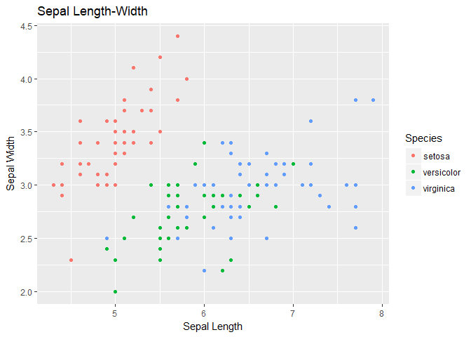

Let’s view this plot through the grammar of graphics:

1.  The **data** variable Sepal Length gets mapped to the *x-position*
    aesthetic of the points.
2.  The **data** variable Sepal Width gets mapped to the *y-position*
    aesthetic of the points.
3.  The **data** variable Species gets mapped to the *color* aesthetic
    of the points.

The data variables correspond to columns in the iris data frame.  
Note that data has to be in data frame format!  
The geometric object considered here is of type point, but there are
other types like lines, bars...

<table>
<thead>
<tr class="header">
<th>Data variable</th>
<th>Aes</th>
<th>Geom</th>
</tr>
</thead>
<tbody>
<tr class="odd">
<td>Sepal Length</td>
<td>x</td>
<td>point</td>
</tr>
<tr class="even">
<td>Sepal Width</td>
<td>y</td>
<td>point</td>
</tr>
<tr class="odd">
<td>Species</td>
<td>color</td>
<td>point</td>
</tr>
</tbody>
</table>

How to construct a plot?
------------------------

1.  Specify your data

<!-- -->

    ggplot(data=iris)

1.  Specify mapping of variables to aesthetic components

<!-- -->

    ggplot(data=iris, mapping= aes(x=Sepal.Length, y= Sepal.Width))

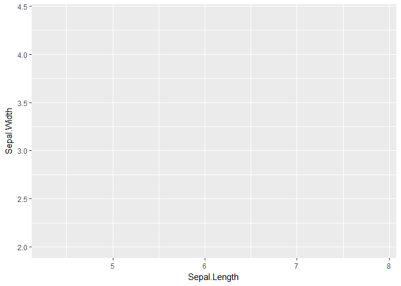

1.  Add layer : specify geometric object type

<!-- -->

    ggplot(data=iris, aes(x=Sepal.Length, y= Sepal.Width)) +
      geom_point()

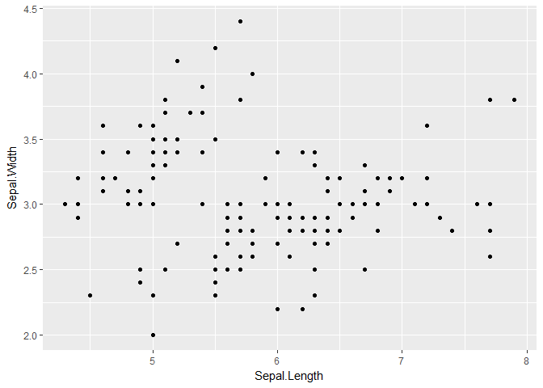

1.  Add other layers like title, labels and theme

<!-- -->

    ggplot(data=iris, aes(x=Sepal.Length, y= Sepal.Width)) +
      geom_point() +
      ggtitle("Sepal Length-Width")

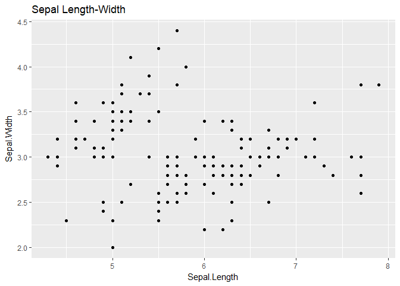

Exercise 1 : warm up
--------------------

Checks:  
- Title  
- Labels  
- Shape  
- Color  
- Transparency

**Take away :**  
1. Note that there is no aes() surrounding alpha = 0.5 and color="red"
here. Since we are NOT mapping a variable to an aesthetic but instead
are just changing a setting, we don’t need to create a mapping with
aes().  
2. To improve legibility of your code, it's recommended to start a new
line whenever adding a layer.  
3. Note that your have to put the **+ sign** always at the end of your
line.

Update data layers
------------------

Create your base plot and save it as a variable.

    p1<- ggplot(data=iris, aes(x = Sepal.Length, y = Sepal.Width)) + 
      geom_point(aes(color=Species)) +
      xlab("Sepal Length") +  
      ylab("Sepal Width") +
      ggtitle("Sepal Length-Width")

Use *%+%* to update your data layer.

    p2 <- p1 %+% aes(shape=Species)
    p2

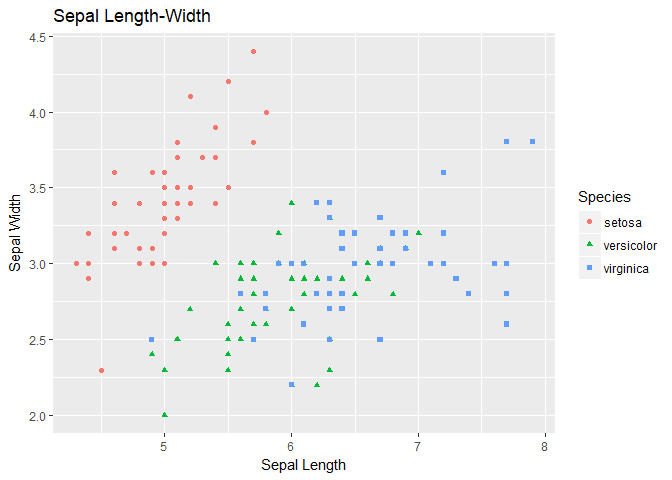

    p2 %+%
      aes(y=Petal.Length) %+% 
      ggtitle(" ")

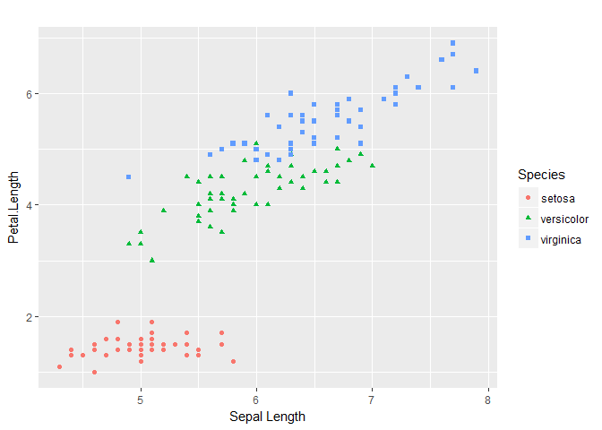

Add a data layer.

    p3 <- p2 + geom_smooth(method="lm", se=F)
    p3

    p4 <- p3 + facet_wrap(~Species)
    p4

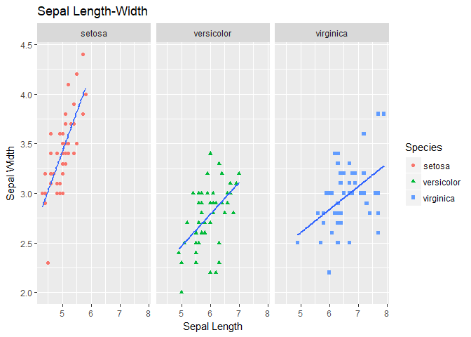

It's useful to also save commonly used data layers and combine them
easily.

    fw <- facet_wrap(~Species)
    p1 + fw

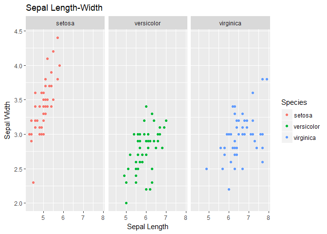

    p2 + fw

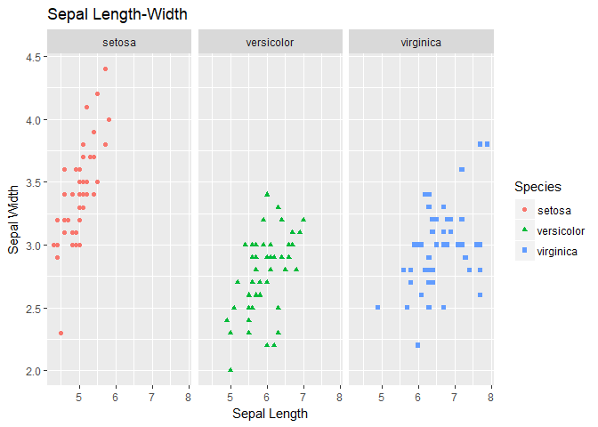

Facets
------

    library(nycflights13)
    mia_flights <- flights %>% 
      filter(dest == "MIA", !is.na(arr_delay))

    ## `stat_bin()` using `bins = 30`. Pick better value with `binwidth`.

    ## `stat_bin()` using `bins = 30`. Pick better value with `binwidth`.

We start with a basic histogram.

    h1<- ggplot(data=mia_flights,aes(x=air_time)) +
           geom_histogram()  
    h1

    ## `stat_bin()` using `bins = 30`. Pick better value with `binwidth`.

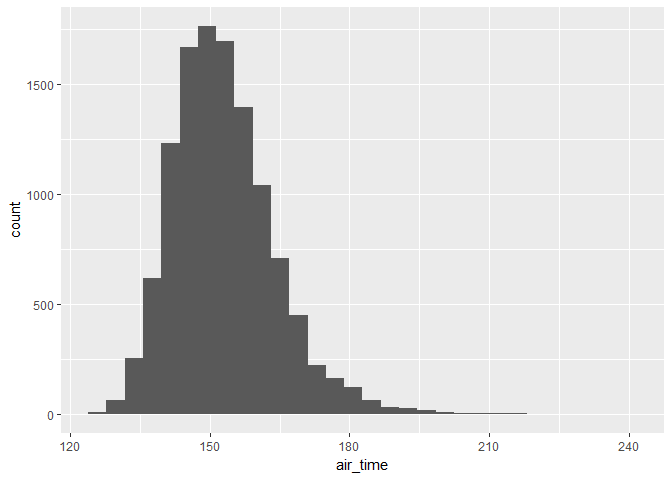

We split it into groups.

    h1 +  facet_wrap(~origin)

    ## `stat_bin()` using `bins = 30`. Pick better value with `binwidth`.

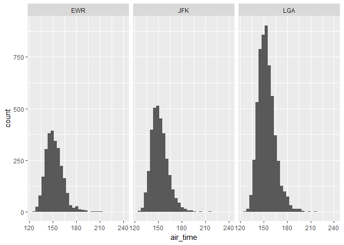

You can play with the scale.

    fw<- facet_wrap(~origin,scales='free_x')
    h3<- h1 + fw
    h3

    ## `stat_bin()` using `bins = 30`. Pick better value with `binwidth`.

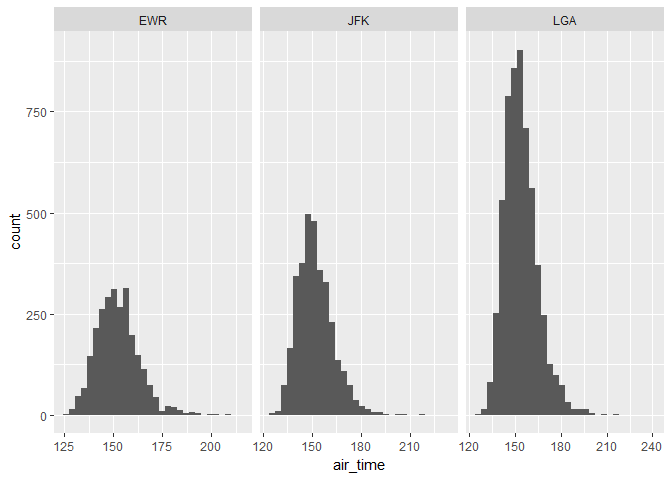

Update a layer.  
And play with facet\_wrap & facet\_grid.

    h4<-h3  %+% aes(fill=origin)
    h4

    ## `stat_bin()` using `bins = 30`. Pick better value with `binwidth`.

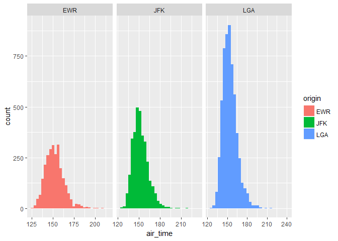

    h4 + facet_grid(carrier~origin,scales='free_x')

    ## `stat_bin()` using `bins = 30`. Pick better value with `binwidth`.

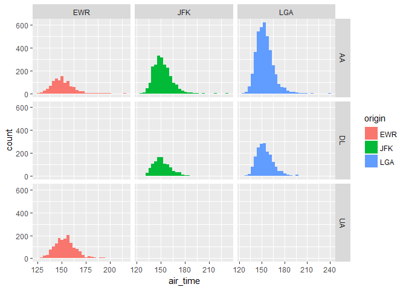

    h4 + facet_wrap(carrier~origin, scales='free_x')

    ## `stat_bin()` using `bins = 30`. Pick better value with `binwidth`.

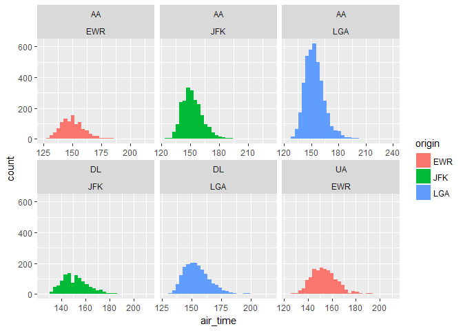

Take away :  
1. What is the difference between facet\_grid & facet\_wrap?

*Facet\_grid(x~y)* will show all \*\*x\*y plots\*\* even if a plot is
empty.  
*Facet\_wrap(x~y)* only shows plots having actual values.

1.  Scales can be made independent, by setting them *'free'*.

Exercise 2: How does air\_time evolves?
=======================================

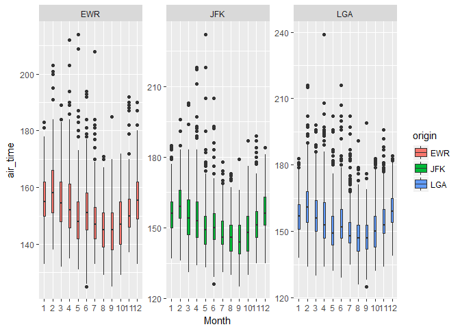

Highlight the chick!
====================

We can plot the evolution of the weight of chicks over time.

    data(ChickWeight)
    ggplot() +
      geom_line(data=ChickWeight, aes(x=Time, y=weight, group=Chick), color = "gray") 

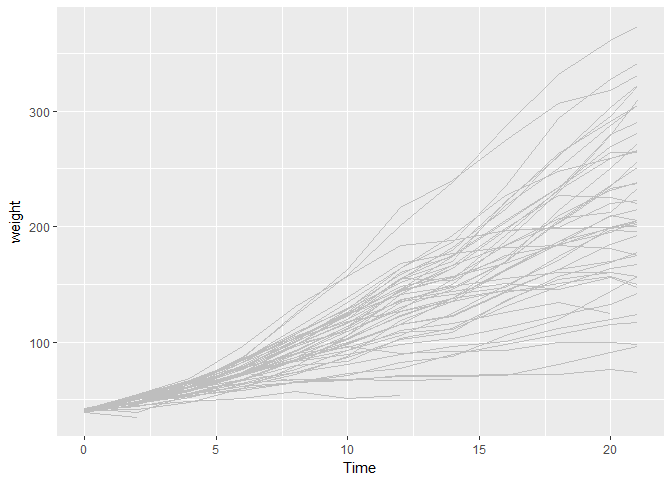

But tell me, how does the weight of Chick 17 evolve?

    ggplot() +
      geom_line(data=ChickWeight, aes(x=Time, y=weight, group=Chick), color = "gray") +
      geom_line(data=subset(ChickWeight, Chick==17),
                aes(x=Time, y=weight, group=Chick), color = "red", size = 1) +
      labs(title = "Weight of Chicks 17 versus other chicks")

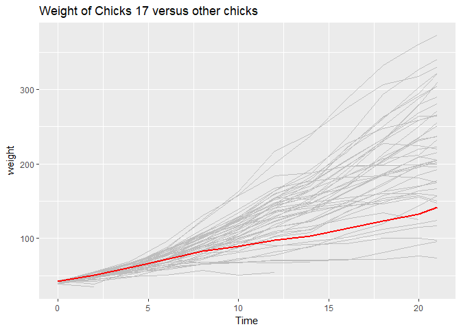

Select multiple chicks upfront to highlight them.

    selected_chicks <- ChickWeight %>%
      filter(Chick %in% c(15, 16, 17))

    ggplot(data=ChickWeight, aes(x=Time, y=weight, group=Chick)) +
      geom_line(color = "gray") +
      geom_line(data=selected_chicks, aes(color = Chick), size = 1) +
      labs(title = "Weight of Chicks 15, 16, 17 versus other chicks")

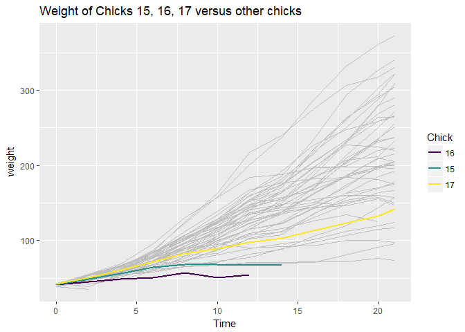

Themes
======

Let's create the ugliest plot you've ever seen
----------------------------------------------

In the theme layer you specify all visual elements that are not part of
the data like text, lines and rectangels.

Let's go back to our original ChickWeight plot

    cw<-ggplot() +
      geom_line(data=ChickWeight, aes(x=Time, y=weight, group=Chick), color = "gray") 

    cw

And let's change the background color to green.

    cw + theme(plot.background=element_rect(fill="green"))

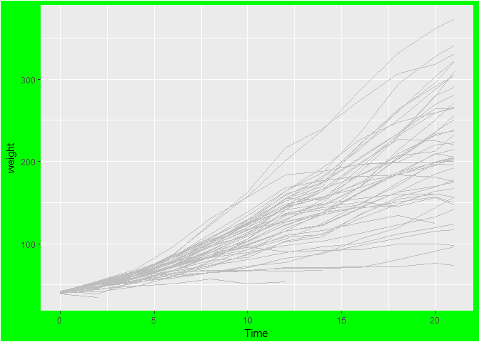

Add a thick red border.

    cw + theme(plot.background=element_rect(fill="green", color="red", size=5))

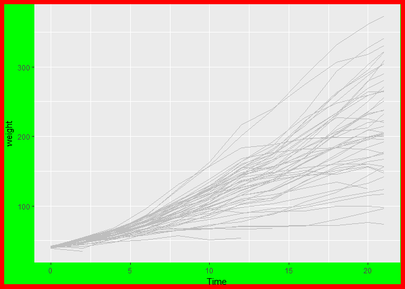

Let's get rid of the grey panel background.

    cw + theme(plot.background=element_rect(fill="green", color="red", size=5),
               panel.background=element_blank())

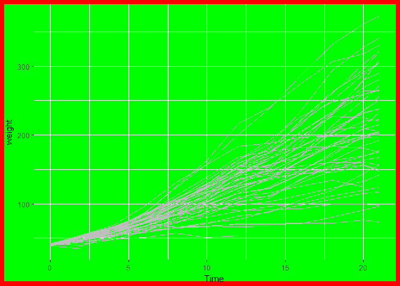

You will love element\_blank()! Do you really need those gridlines?

    cw + theme(plot.background=element_rect(fill="green", color="red", size=5),
               panel.background=element_blank(),
               panel.grid = element_blank())

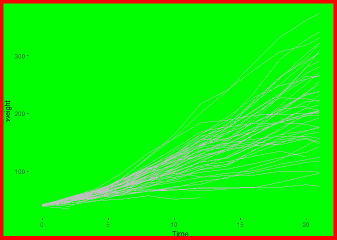

Let's make this plot even more ugly by adding blue lines and yellow
ticks.

    cw + theme(plot.background=element_rect(fill="green", color="red", size=5),
               panel.background=element_blank(),
               panel.grid = element_blank(),
               axis.line=element_line(color="blue"),
               axis.ticks=element_line(color="yellow"))

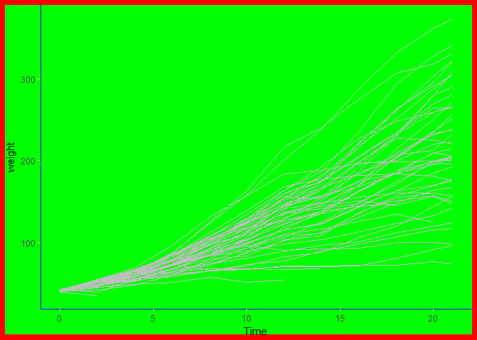

To finish, we should definitely pimp the x axis label!

    cw + theme(plot.background=element_rect(fill="green", color="red", size=5),
               panel.background=element_blank(),
               panel.grid = element_blank(),
               axis.line=element_line(color="blue"),
               axis.ticks=element_line(color="yellow"),
               axis.title.x=element_text(color="darkblue",hjust=0,face="italic"))

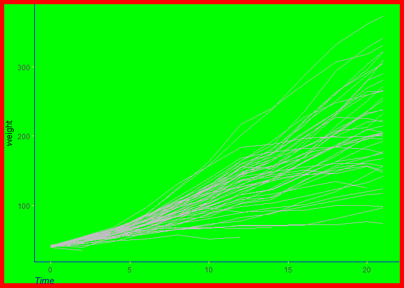

We should definitely save our theme, because we want to apply it to all
our plots!

    ugly_theme <- theme(plot.background=element_rect(fill="green", color="red", size=5),
                        panel.background=element_blank(),
                        panel.grid = element_blank(),
                        axis.line=element_line(color="blue"),
                        axis.ticks=element_line(color="yellow"),
                        axis.title.x=element_text(color="darkblue",hjust=0,face="italic"))

Remember our 'iris plot'?

    iris_plot <- ggplot(data=iris, aes(x=Sepal.Length, y= Sepal.Width)) +
      geom_point(aes(shape=Species), alpha=0.5, color="red") +
      xlab("Sepal Length") +
      ylab("Sepal Width") +
      ggtitle("Sepal Length-Width")

    iris_plot

    iris_plot + ugly_theme

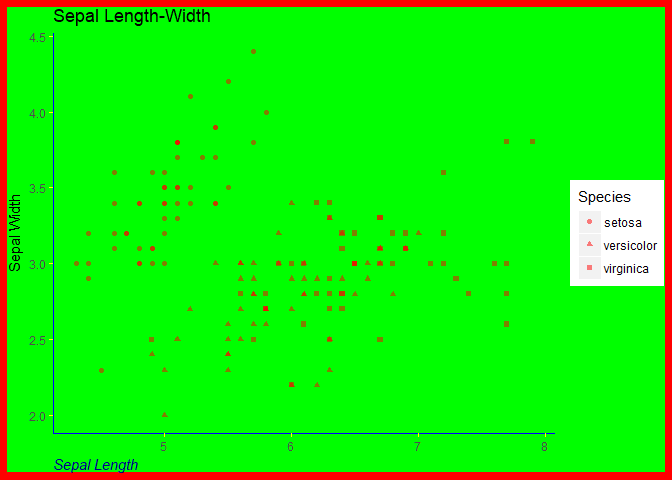

If you want to change some other things not included in your theme, you
can just add another theme\_layer.

    iris_plot + ugly_theme + theme(legend.background = element_blank(),
                                   legend.key  = element_blank())

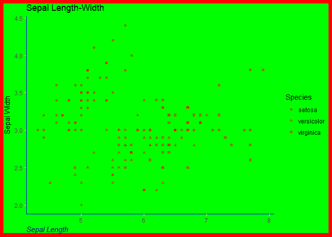

Exercise 3
----------

Use the theme\_layer to convert our original iris\_plot to the following
one.

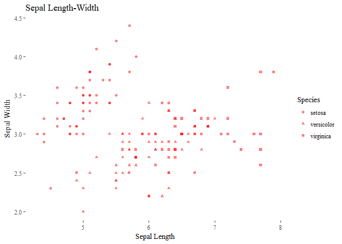

Ggthemes
--------

<http://www.ggplot2-exts.org/ggthemes.html>  
<https://github.com/jrnold/ggthemes>

    iris_plot + theme_bw()

Note that you can just add your own theme preferences upon an existing
theme.  
Here we use theme\_bw(), but we want to remove the ticks.

    iris_plot + theme_bw() + theme(axis.ticks=element_blank())

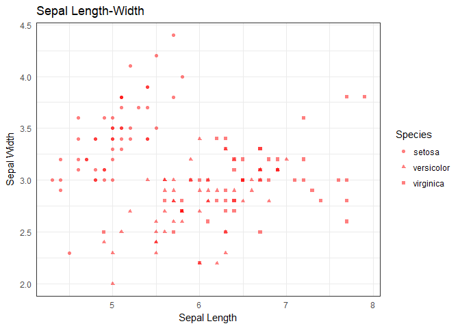

To know what's in a theme.

    theme_bw

    ## function (base_size = 11, base_family = "", base_line_size = base_size/22, 
    ##     base_rect_size = base_size/22) 
    ## {
    ##     theme_grey(base_size = base_size, base_family = base_family, 
    ##         base_line_size = base_line_size, base_rect_size = base_rect_size) %+replace% 
    ##         theme(panel.background = element_rect(fill = "white", 
    ##             colour = NA), panel.border = element_rect(fill = NA, 
    ##             colour = "grey20"), panel.grid = element_line(colour = "grey92"), 
    ##             panel.grid.minor = element_line(size = rel(0.5)), 
    ##             strip.background = element_rect(fill = "grey85", 
    ##                 colour = "grey20"), legend.key = element_rect(fill = "white", 
    ##                 colour = NA), complete = TRUE)
    ## }
    ## <environment: namespace:ggplot2>

Did you know that there's also an RLadies theme?  
You can find it on Github

<https://github.com/rladies/starter-kit/blob/master/rladiesggplot2theme.R>

Let's make our 'iris plot' RLadies-style!

    iris_plot + r_ladies_theme()

    ## Warning in grid.Call(C_textBounds, as.graphicsAnnot(x$label), x$x, x$y, :
    ## font family not found in Windows font database

    ## Warning in grid.Call(C_textBounds, as.graphicsAnnot(x$label), x$x, x$y, :
    ## font family not found in Windows font database

    ## Warning in grid.Call(C_textBounds, as.graphicsAnnot(x$label), x$x, x$y, :
    ## font family not found in Windows font database

    ## Warning in grid.Call(C_textBounds, as.graphicsAnnot(x$label), x$x, x$y, :
    ## font family not found in Windows font database

    ## Warning in grid.Call(C_textBounds, as.graphicsAnnot(x$label), x$x, x$y, :
    ## font family not found in Windows font database

    ## Warning in grid.Call(C_textBounds, as.graphicsAnnot(x$label), x$x, x$y, :
    ## font family not found in Windows font database

    ## Warning in grid.Call(C_textBounds, as.graphicsAnnot(x$label), x$x, x$y, :
    ## font family not found in Windows font database

    ## Warning in grid.Call(C_textBounds, as.graphicsAnnot(x$label), x$x, x$y, :
    ## font family not found in Windows font database

    ## Warning in grid.Call(C_textBounds, as.graphicsAnnot(x$label), x$x, x$y, :
    ## font family not found in Windows font database

    ## Warning in grid.Call(C_textBounds, as.graphicsAnnot(x$label), x$x, x$y, :
    ## font family not found in Windows font database

    ## Warning in grid.Call(C_textBounds, as.graphicsAnnot(x$label), x$x, x$y, :
    ## font family not found in Windows font database

    ## Warning in grid.Call(C_textBounds, as.graphicsAnnot(x$label), x$x, x$y, :
    ## font family not found in Windows font database

    ## Warning in grid.Call.graphics(C_text, as.graphicsAnnot(x$label), x$x, x
    ## $y, : font family not found in Windows font database

    ## Warning in grid.Call.graphics(C_text, as.graphicsAnnot(x$label), x$x, x
    ## $y, : font family not found in Windows font database

    ## Warning in grid.Call.graphics(C_text, as.graphicsAnnot(x$label), x$x, x
    ## $y, : font family not found in Windows font database

    ## Warning in grid.Call(C_textBounds, as.graphicsAnnot(x$label), x$x, x$y, :
    ## font family not found in Windows font database

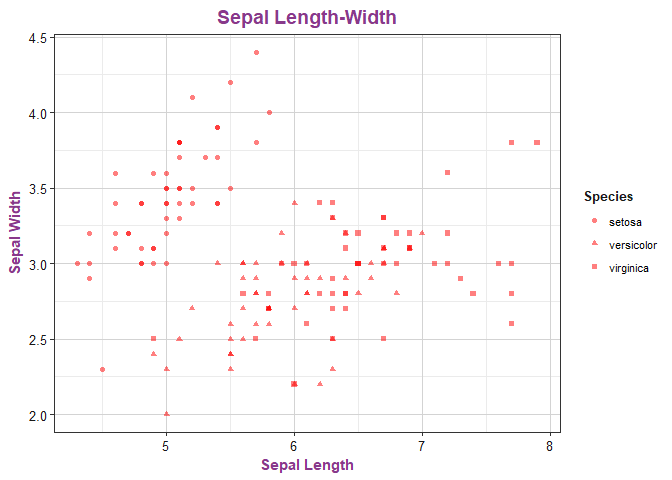

Zoom on Barplots (by Huong)
===========================

The default barplot lay-out is verticle.

    ggplot(pct.crash.table, aes(x = BOROUGH, y = total.injured)) +
      # make bar graphs; default is verticle
      geom_bar(stat = "identity")

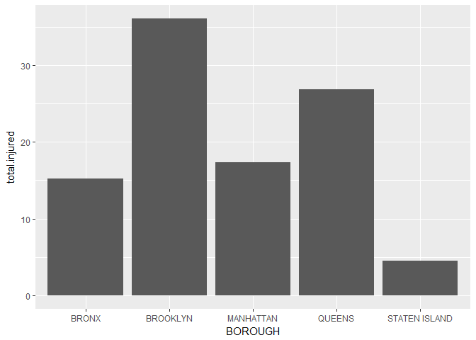

You can change it to horizontal by using coord\_flip().

    ggplot(pct.crash.table, aes(x = BOROUGH, y = total.injured)) +
      # change the colors of bars
      geom_bar(stat = "identity", colour = "orange") +
      # horizontal bars
      coord_flip()

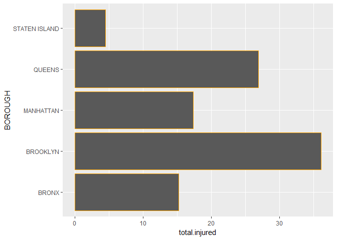

You can set colour: it will set the outline colour of your bars.  
You can set fill : it will set the colour of your bars.

    ggplot(pct.crash.table, aes(x = BOROUGH, y = total.injured)) +
      # change the colors of bars
      geom_bar(stat = "identity", colour = "orange", fill="orange") +
      # horizontal bars
      coord_flip()

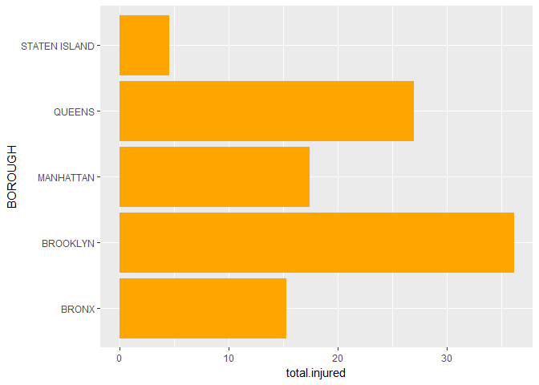

You can reorder your data in the data layer.  
And change the labels of x and y axis.

    ggplot(pct.crash.table, aes(x = reorder(BOROUGH, total.injured), y = total.injured)) +
      geom_bar(stat = "identity", colour = "orange", fill ="orange") +
      coord_flip() +
      labs(x = "borough",
           y = "total injured (%)")

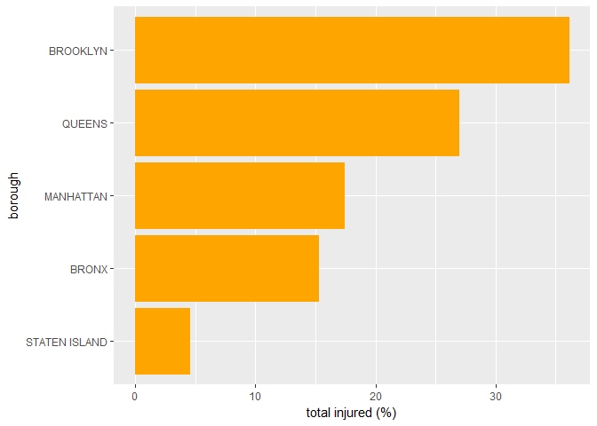

How do we create following plot?
--------------------------------

From this plot

To this plot

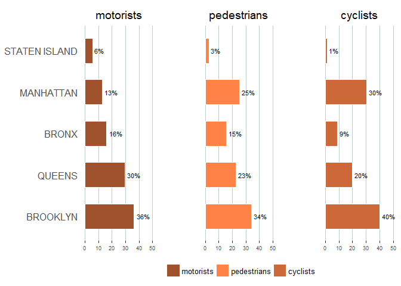

Let's go step by step!

Set the data layer.

    m1<- ggplot(modes.injured2, aes(x = reorder(borough1, -value2), y = value, fill = variable))
    m1

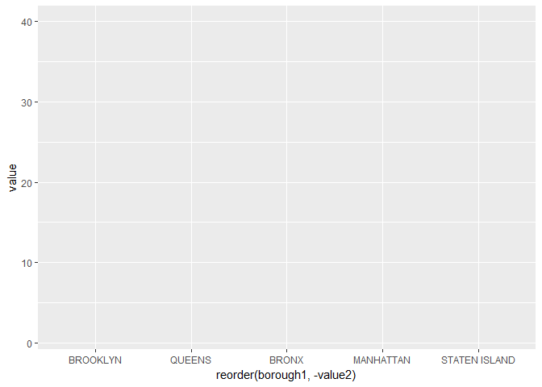

Add geom\_bar. Note that we set the colour.

    m1 + geom_bar(stat = "identity", colour = "gray100")

We want to change the width.

    m1 + geom_bar(stat = "identity", colour = "gray100", width = .6)

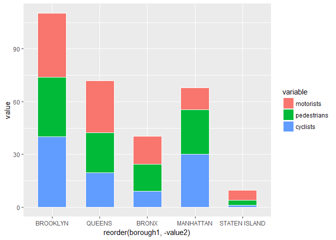

And change the position.

    m2 <- m1 + geom_bar(stat = "identity", colour = "gray100", width = .6, position = "dodge")
    m2

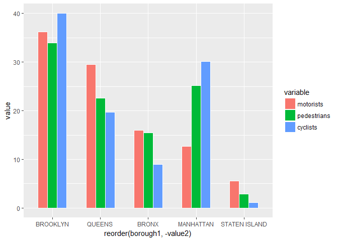

Let's flip the axes.

    m3 <- m2 + coord_flip()
    m3

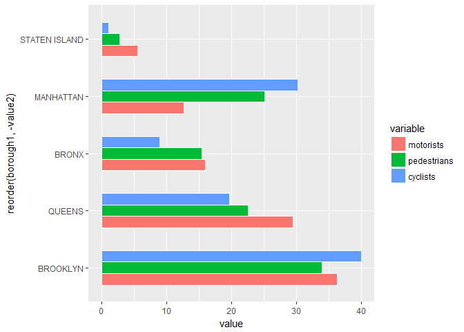

Let's add some data labels!

    m4 <- m3 +  geom_text(aes(label = paste0(round(modes.injured2$value,0), "%")),
                          position = position_dodge(width = 0.5),
                          hjust = - .2, 
                          size = 3)
    m4

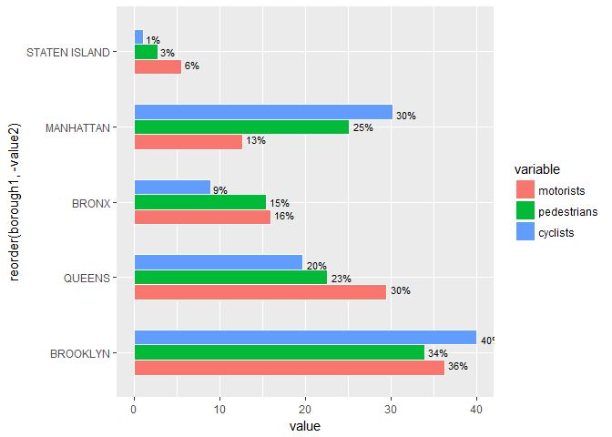

Let's manually define the colors.

    modes.colors = c("motorists" = "sienna",
                     "pedestrians" = "sienna1",
                     "cyclists" = "sienna3")

    m5 <- m4 + scale_fill_manual("", values = modes.colors)
    m5

Enlarge the y-axis manually from 0 to 50.

    m6 <- m5 + scale_y_continuous(limits = c(0,50)) 
    m6

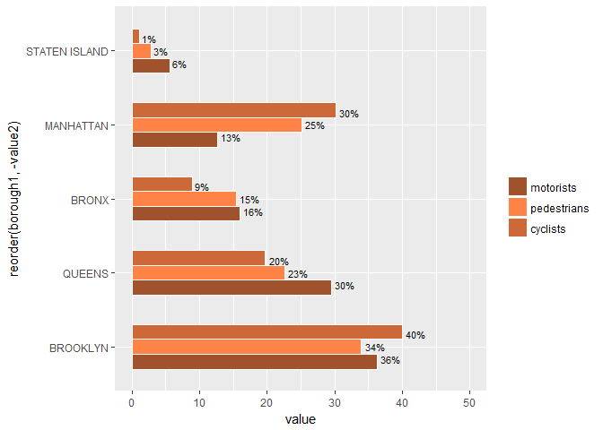

Move the legend to the bottom.

    m7 <- m6 + 
      theme(legend.position = "bottom",
            legend.text = element_text(size = 10))
    m7

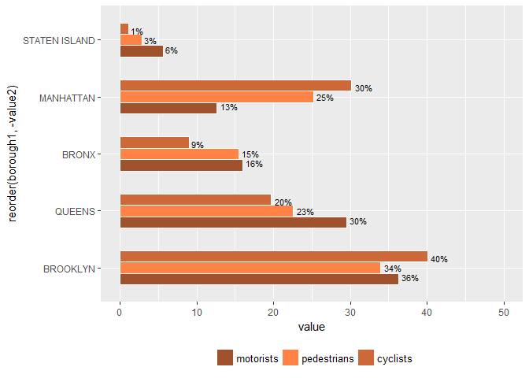

Get rid of the grey background and add lines for 0, 10, 20..

    m8 <- m7 +
      guides(fill = guide_legend(nrow = 1, byrow = TRUE, reverse = FALSE)) +
      theme(axis.text.x =element_text(size = 7),
            axis.title.x = element_blank(),
            axis.line.x = element_blank(),
            axis.text.y =element_text(size = 12),
            axis.title.y = element_blank(),
            axis.ticks.y = element_blank(),
            axis.line.y = element_blank(),
            panel.grid.major.x = element_line(colour = "azure3", size = 0.2),
            panel.background = element_blank(),
            panel.spacing = unit(4, "lines"))
    m8

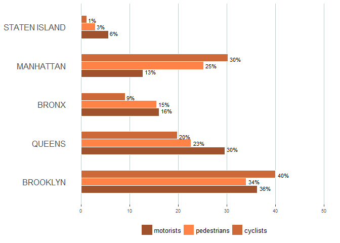

Putting graphs side by side.

    m9<- m8 + facet_grid(. ~ variable5, scales = "fixed", space = "free")
    m9

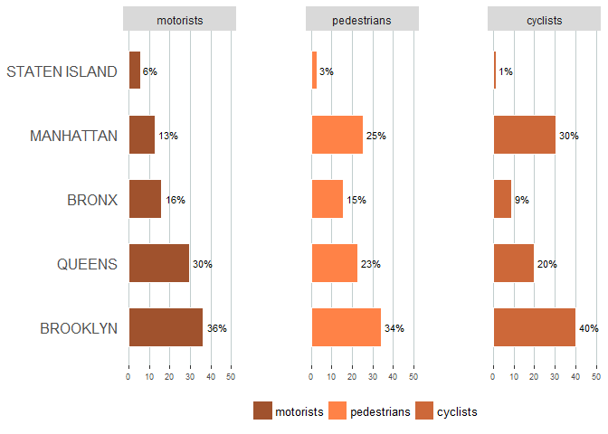

Change facet label.

    m10 <- m9 + theme(strip.background = element_blank(),
                      # put facet label to the left of axis label
                      strip.placement = "outside",
                      strip.text.x = element_text(angle = 0,colour= "black",size = unit(14,'pt')))
    m10

Extra
=====

Heatmap
-------

    ggplot(data=me,aes(x=hour,y=wd)) + 
      geom_tile(aes(fill=avg_dist)) + 
      scale_fill_gradientn(colors=c( "darkblue", "orange","yellow"), name="minutes") + 
      labs(title="Average delay in arrival when flying from JFK airport in 2013",
           subtitle="By hour and weekday",
           caption = "When would you book your flight?") +
      theme(
        panel.background=element_blank(), 
        axis.ticks=element_blank(),
        axis.title=element_blank()
      )

Extensions
----------

There are some great ggplot extensions
<http://www.ggplot2-exts.org/gallery/>

Add labels to your points with ggrepel
--------------------------------------

    ggplot(data=mia_flights, aes(x=dep_delay, y= arr_delay, color=carrier)) +
      geom_point() +
      geom_text(data=filter(mia_flights, dep_delay>500), aes(label=origin))

You can avoid overlapping by using the ggrepel package.

    library(ggrepel)
    ggplot(data=mia_flights, aes(x=dep_delay, y= arr_delay, color=carrier)) +
      geom_point() +
      geom_text_repel(data=filter(mia_flights, dep_delay>500), aes(label=origin))

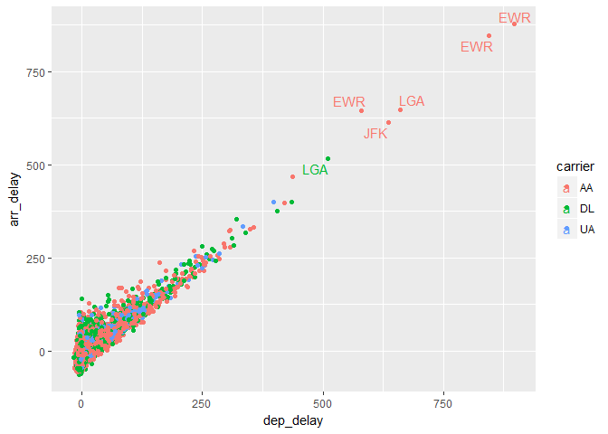

GGally
------

How is my data distributed?

    library(GGally)
    ggpairs(iris)

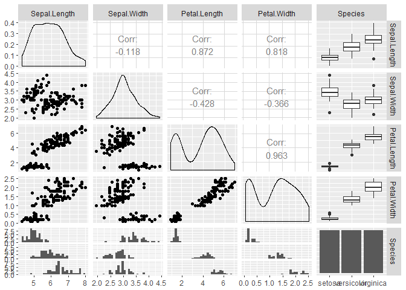

Patchwork
---------

Combine plots how you want!  
<https://github.com/thomasp85/patchwork>

    library(patchwork)
    p1<-ggplot(data=iris, aes(x = Sepal.Length, y = Sepal.Width)) + 
      geom_point(aes(color=Species)) +
      xlab("Sepal Length") +  
      ylab("Sepal Width") +
      ggtitle("Sepal Length-Width")
    p2 <- p1 %+% aes(shape=Species) + geom_smooth(method="lm", se=F)
    p1 + p2

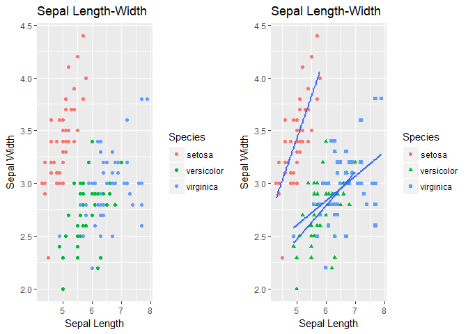

Colors
------

Do you need some ideas for great matching colors?  
<https://colorbrewer2.org>
